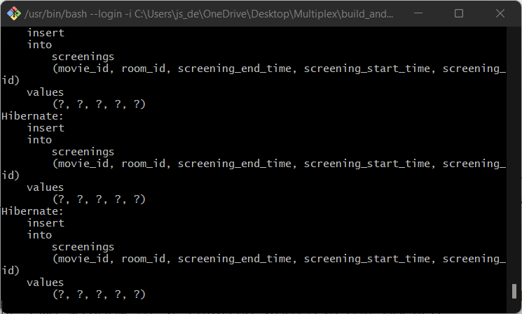
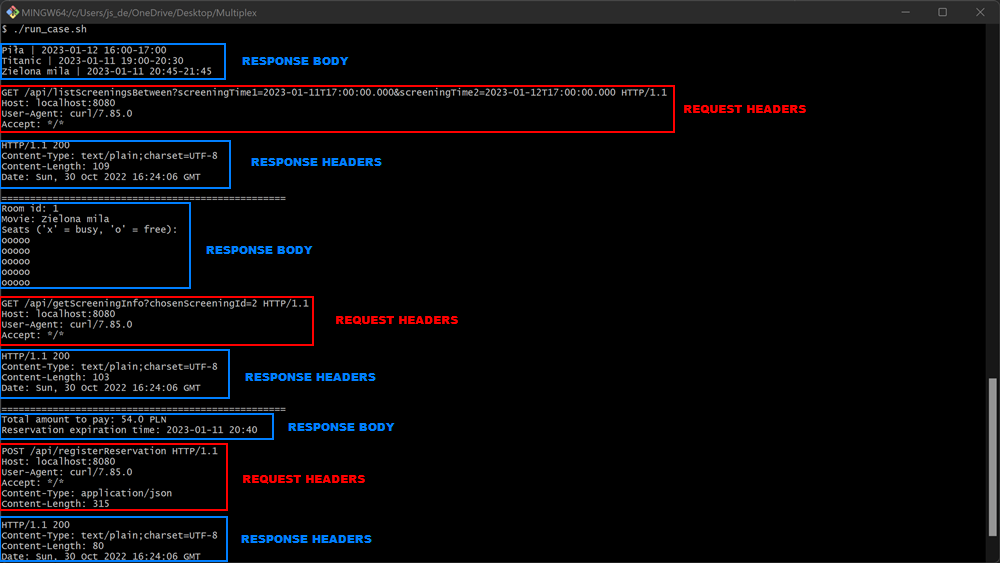

/ Author: Jakub Sobolewski /

========== **README** ==========

**APPLICATION MEANING**

The application is a simple ticket booking app for a multiplex.
  

**REQUIREMENTS TO RUN APPLICATION**
1. You need to have Java JDK installed (preferred version: 17).
2. If you're working on Windows, you need to have Git installed (.sh scripts with Git Bash). You can also run them with WSL.
If you are working on Linux - you just have to run the scripts (type command '_./script_name.sh_' in main folder of the project).
3. You also need to have PostgreSQL database installed in a system (preferred version: 15).
4. For run_case.sh script you need to have cURL installed in a system.
  
   
**HOW TO BUILD AND RUN APPLICATION**
1. Download and extract the zip of master branch.
2. Application has Maven Wrapper included, so to build and run project you just have to run 'build_and_run_project.sh' script, located in main folder of the application.
3. Leave the cmd window of a running application opened:

   
And open 'run_case.sh' script to run example case and display HTTP requests & responses:

4. To close the application just click combination Ctrl+C in a running application's cmd window.
  
   
**ADDITIONAL INFORMATION ABOUT RUNNING THE APP**
   
1. After running the 'build_and_run_project.sh' script there should be a 'target' folder created.
   In this folder you can find 'Multiplex-0.0.1-SNAPSHOT.jar' file, so you can run the application later, by simply typing: '_java -jar Multiplex-0.0.1-SNAPSHOT.jar_' in your terminal.
   
2. You can also run multiple instances of an app by adding '_--server.port=port_number_' parameter to '_java_' command.
  

**ADDITIONAL ASSUMPTIONS**
1. We assume that no movie ends after midnight.
2. For one reservation (ticket) there can be multiple places, but we assume they're all one type (for Student/Adult/Child).
3. We assume reservation expires 5 minutes before screening starts. If the user won't appear at latest 5 minutes before screening starts - the ticket is lost.
4. We assume that every room is 5 rows x 5 seats.